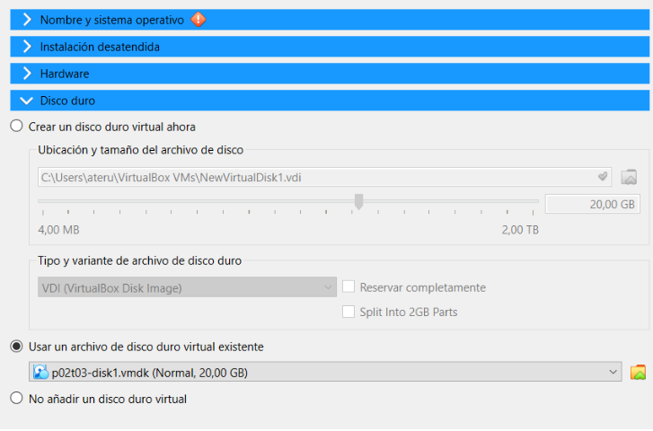
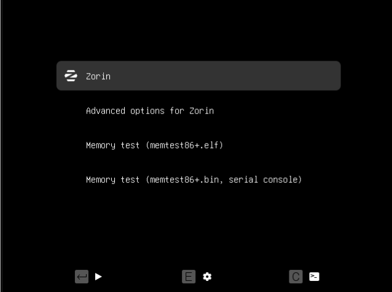
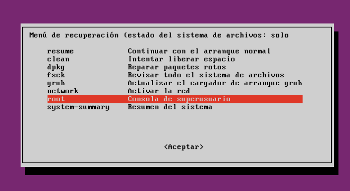
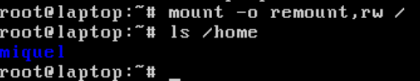
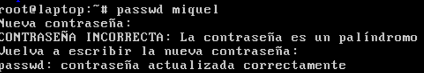
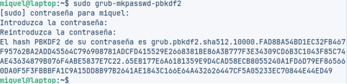
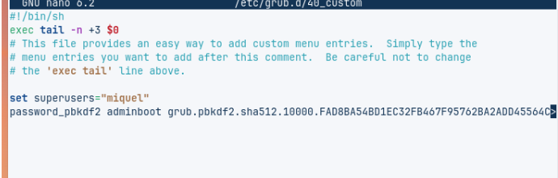
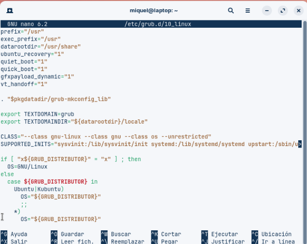

# Seguretat

## 1. Crear la màquina virtual i connectar el disc

1. Obre el teu VirtualBox.  
2. Crea una nova màquina virtual però no li afegeixis cap ISO d’instal·lació.  
3. Tria com a sistema operatiu base **Linux**.  
4. A l’apartat d’emmagatzematge, elimina el disc que crea per defecte i afegeix el disc virtual que t’ha proporcionat.

5. Desa la configuració i arrenca la màquina.

---

## 2. Accedir al GRUB i entrar en mode de recuperació

1. Reinicia la màquina virtual i prem repetidament la tecla `Esc` immediatament després de l’encesa.  
2. Apareixerà el menú de GRUB amb diverses opcions.

3. Selecciona l’opció **Advanced options for Zorin** i prem `Enter`.  
4. Dins d’aquest menú, veuràs una o més opcions del tipus.  
5. Escull la que diu **(recovery mode)** i prem `Enter`.

6. Mou-te amb les fletxes fins a l’opció **root** i prem `Enter`.

7. Ara tindràs un terminal com a root (sense demanar contrasenya).  
8. Per poder modificar fitxers i contrasenyes, executa `mount -o remount,rw /`.  
9. Per veure quin és l’usuari original del directori, fes `ls /home`.  
10. Canviar la contrasenya de l’usuari amb `passwd miquel`.

11. Un cop feta la modificació, introdueix `reboot`.  
12. Ara ja es pots iniciar sessió amb la nova contrasenya.

---

## 3. Fortificar el GRUB amb contrasenya

La protecció del carregador GRUB és fonamental per evitar que usuaris no autoritzats puguin modificar els paràmetres d'arrencada o accedir al sistema en mode d'usuari únic, tal com es demostra a l'exercici inicial on es vulnera l'accés canviant la contrasenya.

1. El primer pas és crear una contrasenya amb xifratge PBKDF2. GRUB versió 2.x ja no suporta xifrat MD5 de versions anteriors.  
2. Des de la terminal amb permisos de root, executar `sudo grub-mkpasswd-pbkdf2`.

3. El sistema sol·licitarà ingressar la contrasenya dues vegades i generarà un hash similar a:

4. És fonamental copiar aquest hash complet (des de `grub.pbkdf2` en endavant) per al següent pas.

5. **Configuració del fitxer de seguretat:**  
   Editeu el fitxer `/etc/grub.d/40_custom` per incloure la configuració de seguretat.

6. Afegir al final del fitxer les línies següents:

'set superusers="miquel"'
'password_pbkdf2 adminboot grub.pbkdf2.sha512.10000.xxxxxxxxxxxxx…'

---

## 4. Configuració d'arrencada sense restriccions

1. Editeu el fitxer `/etc/grub.d/10_linux`.  
2. Buscar la línia que conté `CLASS=` i afegir `--unrestricted`:  
   `CLASS="--class gnu-linux --class gnu --class os --unrestricted"`

Aquesta configuració permet que el sistema arrenqui normalment sense sol·licitar contrasenya, però qualsevol intent d'editar les entrades del menú (pressionant `e`) o accedir a la consola de GRUB (pressionant `c`) requerirà l'usuari i la contrasenya configurats.

3. Actualització de la configuració de GRUB amb `sudo update-grub`.  
4. Verificació de la protecció.  
5. Reiniciar el sistema per verificar la configuració amb `sudo reboot`.

En intentar editar una entrada del menú durant l'arrencada, el sistema sol·licitarà el nom d'usuari i la contrasenya configurats. No obstant això, l'arrencada normal del sistema operatiu predeterminat es produirà sense demanar credencials.

---

## Fonts

https://linuxconfig.org/how-to-secure-grub-boot-loader-with-password  
https://docs.redhat.com/es/documentation/red_hat_enterprise_linux/8/html/managing_monitoring_and_updating_the_kernel/assembly_protecting-grub-with-a-password_managing-monitoring-and-updating-the-kernel  
https://forum.zorin.com/t/howto-setup-grub-bootloader-password-zorin-os-17/33851  
https://www.tecmint.com/password-protect-grub-in-linux/
